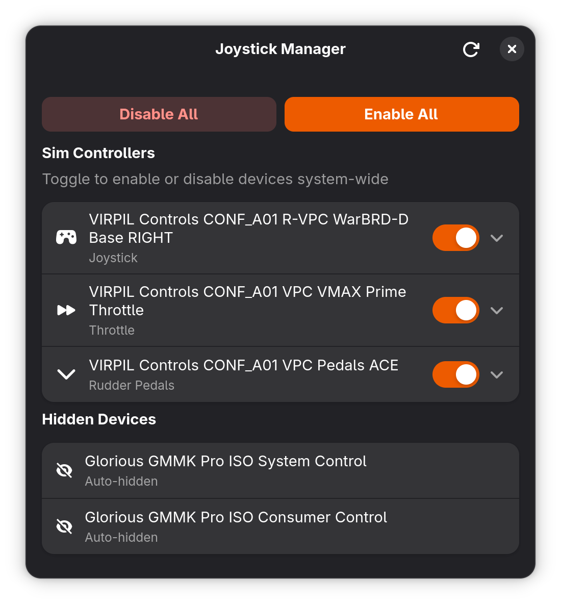

# JoyToggle 🕹️

A clean GNOME app for Linux that lets you enable or disable joysticks, throttles, rudder pedals and gamepads without unplugging them.

**Built for sim pilots** — if you fly with a full HOTAS setup (Virpil, Thrustmaster, CH Products, etc.) you know the pain of non-sim games hijacking your controllers and breaking your layout. JoyToggle solves that.



## Features

- Detect all joystick/gamepad devices automatically
- Enable or disable individual devices with a single toggle
- Disable All / Enable All with one password prompt
- Device state persists across reboots via systemd
- Hides irrelevant devices (media keys, mice) automatically
- Manual hide/restore for any device
- Expandable rows show USB path, vendor ID, device path
- Follows system dark/light theme
- Works on Wayland and X11

## Requirements

- Linux (tested on Arch, should work on any systemd distro)
- Python 3.8+
- GTK4 + libadwaita
- python-gobject
- polkit (for privilege escalation)
- systemd (for boot persistence)

## Installation

### Arch Linux (recommended)

```bash
git clone https://github.com/Mirkko/joytoggle.git
cd joytoggle
chmod +x install.sh
./install.sh
```

### Other distros

Install dependencies first:

```bash
# Ubuntu / Debian
sudo apt install python3 python3-gi gir1.2-gtk-4.0 gir1.2-adw-1 libadwaita-1-dev

# Fedora
sudo dnf install python3 python3-gobject gtk4 libadwaita

# Arch
sudo pacman -S python python-gobject gtk4 libadwaita
```

Then run the install script:

```bash
chmod +x install.sh
./install.sh
```

## Usage

Launch **Joystick Manager** from your app launcher (Super key → search "Joystick").

Or run from terminal:

```bash
python /usr/lib/joytoggle/app.py
```

**Toggling a device** requires your password once per session. After authenticating, further toggles in the same session won't prompt again.

**Hiding a device** — expand a row with the chevron (▾) and click "Hide this device". Hidden devices move to the Hidden Devices section. Auto-hidden devices (media keys, mice) are filtered out automatically.

**Boot persistence** — your last-known state is restored automatically at boot via a systemd service. If all your controllers are disabled when you shut down, they'll be disabled when you boot up.

## Uninstall

```bash
chmod +x uninstall.sh
./uninstall.sh
```

## How it works

JoyToggle uses Linux's USB driver bind/unbind mechanism (`/sys/bus/usb/drivers/usbhid/`) to enable and disable devices at the kernel level — no unplugging required. This works on both X11 and Wayland since it operates below the display server.

Privilege escalation is handled by **polkit** — the same mechanism GNOME uses for software installation. JoyToggle never runs as root itself.

## Device support

JoyToggle detects any device Linux exposes as a joystick (EV_ABS input events). Auto-detected types:

| Type | Detected by name |
|------|-----------------|
| Joystick | joystick, stick, alpha, constellation, warbrd |
| Throttle | throttle, mongoose, vmax |
| Rudder Pedals | pedal, rudder, torq |
| Gamepad | gamepad, xbox, playstation, dualshock |
| Steering Wheel | wheel, steering |

Tested with:
- Virpil VPC Constellation ALPHA-L / ALPHA-R
- Virpil VPC MongoosT / VMAX throttles
- Virpil VPC ACE-TORQ / Rudder pedals
- Xbox controllers
- Generic USB HID joysticks

## Contributing

Pull requests welcome. If your device isn't detected correctly, open an issue with the output of:

```bash
python scanner.py
```
## Credits

This project was built with AI assistance (Claude by Anthropic) for code generation,
with direction, testing, and debugging by the author. All code has been tested on
real hardware — Virpil HOTAS setup on Arch Linux.

## License

GPL v3.
